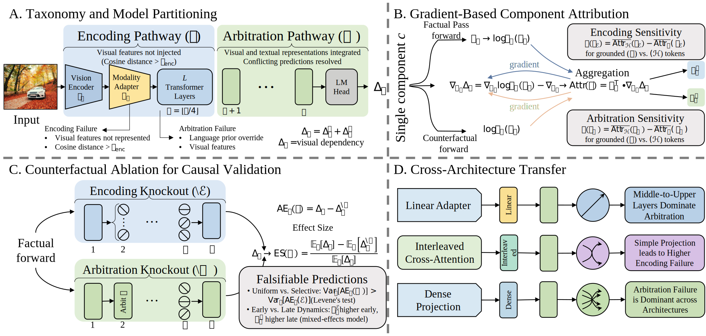

# Encoding or Arbitration: A Mechanistic Taxonomy of Hallucination Failure Modes

## Abstract

Vision-language models (VLMs) increasingly underpin multimodal world simulation and communication systems -- virtual environment generation, digital twin visualization -- yet hallucination undermines the fidelity of simulated world representations. To build trustworthy systems, we must understand *why* they hallucinate, not merely *when*. We propose a mechanistic taxonomy decomposing every hallucinated token into one of two failure modes: **encoding failure**, where visual information is never properly captured, or **arbitration failure**, where it is encoded but overridden by language priors in upper layers. We introduce gradient-based attribution that localizes the visual dependency signal $\Delta_t$ to individual components along the **Encoding Pathway** (vision encoder, projection, early layers) and **Arbitration Pathway** (upper self-attention, MLP, LM head). Counterfactual ablation causally validates the taxonomy: encoding knockout uniformly degrades $\Delta_t$, while arbitration knockout produces selective degradation where language priors conflict with visual evidence (Levene's test $p < 0.001$). Benchmarking against counterfactual restoration patching confirms gradient-based attribution recovers the same critical heads as full causal intervention (**Spearman $\rho = 0.531$**, $p < 0.001$, **$513\times$ speedup**; top-20 heads capture **89.6%** of causal restoration KL at **zero false-positive precision**), with encoding heads carrying $12.8\times$ more unique visual information per head. Across three architectures, we find: (i) **arbitration failure dominates** in LLaVA-1.5 and Qwen2.5-VL ($85$--$88\%$), (ii) InternVL3.5 exhibits a **balanced profile** with $39.7\%$ grounded tokens ($40$--$80\times$ that of LLaVA/Qwen), and (iii) Qwen2.5-VL and InternVL3.5 share **convergent circuits** ($\rho = 0.887$). Our results demonstrate that mechanistic failure-mode diagnosis is a foundation for building safer multimodal world simulation and communication systems.

## Method Overview



The Encoding--Arbitration taxonomy decomposes VLM failures into two mechanistic pathways:

- **Encoding Pathway (E):** Vision encoder $\to$ Projector $\to$ Early LLM layers ($1$--$\lfloor L/4 \rfloor$)
- **Arbitration Pathway (A):** Upper self-attention $\to$ MLP $\to$ LM head ($\lfloor L/4 \rfloor + 1$ through $L$)

For each generated token, a visual dependency score $\Delta_t = \log P_F(\text{chosen}) - \log P_C(\text{chosen})$ is computed through paired factual/counterfactual forward passes. Per-token classification uses encoding strength (L2 norm of head activations) and arbitration ratio ($\|\mathbf{h}_F\| / (\|\mathbf{h}_F\| + \|\mathbf{h}_C\|)$) with per-run relative thresholds. Gradient-based component attribution identifies which attention heads carry visual information, validated against counterfactual restoration patching (the causal gold standard).

## Dataset Structure

### COCO 2014 Validation (primary evaluation dataset)

**Download:** https://cocodataset.org

**Directory structure under `$DATA_ROOT`:**

```
COCO2014/
├── val2014/                              # 40,504 images (JPEG)
│   ├── COCO_val2014_000000000001.jpg
│   ├── COCO_val2014_000000000002.jpg
│   └── ...
└── annotations_trainval2014/
    └── annotations/
        └── instances_val2014.json        # Object bounding boxes, categories
```

**Data format:**
- Images: RGB JPEG, various resolutions, typical ~640x480
- Annotations (instances_val2014.json): 80 object categories, bounding boxes per image
- Each image used for free-form captioning: prompt = "Please describe this image in detail."

### Multi-Task Prompts (5 levels of increasing constraint)

Used for Table 3 in the paper (N = 100 COCO images $\times$ 5 tasks = 1,500 image--task pairs):

| Level | Task | Prompt Template |
| --- | --- | --- |
| 1 | Caption | "Please describe this image in detail." |
| 2 | Descriptive VQA | "What objects and their attributes are visible in this image?" |
| 3 | Factual VQA | "List all the objects present in this image." |
| 4 | Explanatory VQA | "Describe what is happening in this image and explain why." |
| 5 | Yes/No | "Is there a {object} in this image? Answer yes or no." |

### VQAv2 (cross-dataset evaluation)

**Download:** https://visualqa.org

**Directory:** `$DATA_ROOT/vqav2/`

```
vqav2/
    - v2_OpenEnded_mscoco_val2014_questions.json  # Questions
    - v2_mscoco_val2014_annotations.json          # Ground-truth answers
```

### CHAIR Evaluation (hallucination metric)

Uses the COCO segmentation annotations (`instances_val2014.json`) to check whether generated captions contain objects not present in the image. No additional data download needed beyond COCO.

## Environment Setup

### Prerequisites

- Python 3.10+
- CUDA 12.x compatible GPU (24GB+ VRAM recommended for 7B--8B models)
- At least 100GB disk space for model weights and datasets

### Installation

Three separate conda environments for different model families:

**LLaVA-1.5 (legacy environment):**
```bash
conda create -n env-legacy python=3.10 -y
conda activate env-legacy
pip install -r requirements-legacy.txt
```

**Qwen2.5-VL + InternVL3.5 (modern environment -- primary):**
```bash
conda create -n env-modern python=3.10 -y
conda activate env-modern
pip install -r requirements-modern.txt
```

The primary experiments use LLaVA-1.5, Qwen2.5-VL, and InternVL3.5.

**Key dependencies across all environments:**

| Package | Version | Purpose |
| --- | --- | --- |
| torch | >= 2.4.0 | Deep learning framework |
| transformers | 4.51.1 / 4.52.0 | Model loading and inference |
| accelerate | >= 1.0.0 | Multi-GPU and mixed-precision |
| flash-attn | >= 2.7.0 | Efficient attention (optional) |
| numpy, scipy, pandas | latest | Numerical computation |
| matplotlib, seaborn | latest | Visualization |
| pycocotools, pycocoevalcap | latest | COCO and caption evaluation |
| pillow, opencv-python | latest | Image processing |
| qwen-vl-utils | latest | Qwen2.5-VL utilities |
| bitsandbytes | >= 0.45.0 | Quantization (optional) |

## Model and Dataset Paths

All paths are configured via the `DATA_ROOT` environment variable in `config.py`. Models and datasets must be organized under a single root directory:

```bash
export DATA_ROOT=/path/to/your/data/root
```

### Required Models

Download from HuggingFace into `$DATA_ROOT/`:

| Model | HuggingFace ID | Directory |
| --- | --- | --- |
| LLaVA-1.5-7B | `liuhaotian/llava-v1.5-7b` | `$DATA_ROOT/llava-1.5-7b-hf` |
| Qwen2.5-VL-7B | `Qwen/Qwen2.5-VL-7B-Instruct` | `$DATA_ROOT/Qwen2.5-VL-7B-Instruct` |
| InternVL3.5-8B | `OpenGVLab/InternVL3_5-8B-HF` | `$DATA_ROOT/InternVL3_5-8B` |

### Required Datasets

| Dataset | Source | Directory |
| --- | --- | --- |
| COCO 2014 Validation | [cocodataset.org](https://cocodataset.org) | `$DATA_ROOT/COCO2014/` |
| VQAv2 (optional) | [visualqa.org](https://visualqa.org) | `$DATA_ROOT/vqav2/` |

### Expected Full Directory Layout

```
$DATA_ROOT/
├── llava-1.5-7b-hf/              # Model weights (HuggingFace format)
├── Qwen2.5-VL-7B-Instruct/       # Model weights
├── InternVL3_5-8B/               # Model weights
├── COCO2014/
│   ├── val2014/                   # 40,504 JPEG images
│   └── annotations_trainval2014/
│       └── annotations/
│           ├── instances_val2014.json
│           ├── captions_val2014.json
│           └── person_keypoints_val2014.json
└── vqav2/                         # optional: cross-dataset evaluation
    ├── v2_OpenEnded_mscoco_val2014_questions.json
    └── v2_mscoco_val2014_annotations.json
```

## Running Experiments

All commands are run from the repository root directory. All scripts accept `--help` for detailed argument listings.

### Step 1: Encoding--Arbitration Decomposition (Primary Taxonomy ---  Table 1)

The core experiment. Runs on 1,000 COCO images per model. Produces the three-way split (encoding failure / arbitration failure / grounded) for each architecture.

```bash
# Activate the appropriate environment first

# LLaVA-1.5 (env-legacy)
python mechanistic_analysis/run_attribution.py \
    --model llava-1.5 \
    --mode encoding_arbitration \
    --num_samples 1000

# Qwen2.5-VL (env-modern)
python mechanistic_analysis/run_attribution.py \
    --model qwen2.5-vl \
    --mode encoding_arbitration \
    --num_samples 1000

# InternVL3.5 (env-modern)
python mechanistic_analysis/run_attribution.py \
    --model internvl3.5 \
    --mode encoding_arbitration \
    --num_samples 1000
```

Output: `results/attribution_v2/{model}/encoding_arbitration/encoding_arbitration_summary.json`

### Step 2: Gradient vs. Causal Patching Benchmark (513$\times$ Speedup Validation)

Benchmarks gradient-based attribution against counterfactual restoration patching (the causal gold standard). Produces Spearman $\rho$ and top-k coverage metrics.

```bash
python mechanistic_analysis/compare_attribution_methods.py \
    --num_images 1000 \
    --top_k 20
```

Output: `results/revision/topk_coverage/topk_coverage.json`

### Step 3: Top-k Causal Coverage Analysis (Spearman $\rho$ = 0.531)

Reads the output from Step 2 and produces the coverage analysis, regime breakdown, and per-regime correlation metrics.

```bash
python mechanistic_analysis/exp1_topk_coverage.py
```

### Step 4: Main Revision Experiments (P0--P3)

Four sub-experiments addressing fundamental evaluation concerns:

| Flag | Experiment | Description |
| --- | --- | --- |
| `p0` | CAPTION baseline | Encoding--arbitration on COCO captioning |
| `p1` | VQA cross-dataset | Same decomposition on VQAv2; falls back to COCO + template questions if VQAv2 not found |
| `p2` | Single-head attribution | Head-level importance and regime distribution |
| `p3` | Multi-task encoding | Continuous metrics across 5 prompt types |

```bash
# Run all
python mechanistic_analysis/revision_experiments.py \
    --experiment all \
    --model llava-1.5 \
    --num_samples 100

# Or individually:
python mechanistic_analysis/revision_experiments.py --experiment p0 --model llava-1.5
python mechanistic_analysis/revision_experiments.py --experiment p1 --model llava-1.5
python mechanistic_analysis/revision_experiments.py --experiment p2 --model llava-1.5
python mechanistic_analysis/revision_experiments.py --experiment p3 --model llava-1.5
```

### Step 5: R2 Experiments (R1--R3)

Addressing reviewer concerns about signal verification and ablation methodology:

| Flag | Experiment | Description |
| --- | --- | --- |
| `r1` | Path integration | $\Delta$ signal verification across forward pass |
| `r2` | Attention knockout | Causal validation of pathway-level effects |
| `r3` | Head-level patching | Counterfactual patching of individual heads |

```bash
# Run all
python mechanistic_analysis/r2_experiments.py \
    --experiment all \
    --model llava-1.5 \
    --num_images 500
```

### Step 6: R3 Experiments (E1--E5)

Additional experiments with fine-grained causal analysis:

| Flag | Experiment | Key Metric |
| --- | --- | --- |
| `e1` | Fine head ablation + Levene's test | Encoding CV=1.33 vs Arbitration CV=1.60, F=426.1 |
| `e2` | Pathway boundary sensitivity | $\pm$4--6 pp shift across boundary range |
| `e3` | Universal cross-architecture intervention | CHAIRs 2.0% $\to$ 0.0% at $\alpha$=1.2 |
| `e4` | Oracle threshold calibration | $\tau$enc: LLaVA=0.997, Qwen=2.141, InternVL=2.703 |
| `e5` | Counterfactual type comparison | Shuffled patches vs. zero pixel_values |

```bash
# Run all
python mechanistic_analysis/r3_experiments.py \
    --experiment all \
    --model llava-1.5 \
    --num_images 500
```

### Step 7: Multi-Task Continuous Metrics (Table 3, Figure 5)

Runs 5 prompt types across 3 models on the same 100 COCO images (1,500 image--task pairs).

```bash
python mechanistic_analysis/multi_task_encoding.py \
    --model llava-1.5 \
    --num_samples 1000 \
    --seed 42
```

### Step 8: Taxonomy-Guided Intervention (CHAIR Evaluation)

Intervenes on encoding vs. arbitration heads and measures CHAIR hallucination reduction.

```bash
python mechanistic_analysis/exp2_taxonomy_intervention.py
```

### Step 9: Visualization

Generates all paper figures and LaTeX tables from the result JSON files produced by previous steps.

```bash
python mechanistic_analysis/visualize.py --results_dir results/
```

### Step 10: Result Summary

Aggregates results across all experiments into a unified summary.

```bash
python mechanistic_analysis/summarize_results.py
```

## Results Directory

After running experiments, results are saved under `results/` (auto-created):

```
results/
├── attribution_v2/
│   ├── llava-1.5/encoding_arbitration/
│   │   └── encoding_arbitration_summary.json   # enc, arb, grd rates
│   ├── qwen2.5-vl/encoding_arbitration/
│   │   └── encoding_arbitration_summary.json
│   └── internvl3.5/encoding_arbitration/
│       └── encoding_arbitration_summary.json
├── revision/
│   ├── topk_coverage/
│   │   └── topk_coverage.json                  # $\rho$=0.531, 89.6% coverage
│   ├── p1_vqa/
│   │   └── vqa_summary_*.json                  # VQA cross-dataset results
│   └── p2_single_head.json                     # Head scores and regimes
├── r2/
│   └── *.json                                  # R1--R3 results
├── r3/
│   ├── e1_fine_ablation_*.json                 # Levene's test results
│   ├── e3_universal_intervention_*.json        # CHAIRs reduction
│   └── e4_oracle_threshold_*.json              # $\tau$enc calibration
└── multi_task/
    └── multi_task_*.json                        # 5-task continuous metrics
```

## Expected Reproducibility

All key paper claims map to specific experiments and JSON output files:

| Paper Claim | Experiment | Output File |
| --- | --- | --- |
| LLaVA: enc 14.0%, arb 85.5%, grd 0.5% | Step 1 | `attribution_v2/llava-1.5/.../encoding_arbitration_summary.json` |
| Qwen: enc 11.4%, arb 87.6%, grd 1.0% | Step 1 | `attribution_v2/qwen2.5-vl/.../encoding_arbitration_summary.json` |
| InternVL: enc 29.7%, arb 30.6%, grd 39.7% | Step 1 | `attribution_v2/internvl3.5/.../encoding_arbitration_summary.json` |
| Spearman $\rho$=0.531, 89.6% coverage | Step 2--3 | `revision/topk_coverage/topk_coverage.json` |
| Levene's F=426.1, p<0.001 | Step 6 (e1) | `r3/e1_fine_ablation_*.json` |
| CHAIRs 2.0%$\to$0.0% at $\alpha$=1.2 | Step 6 (e3) | `r3/e3_universal_intervention_*.json` |
| Oracle $\tau$enc calibration | Step 6 (e4) | `r3/e4_oracle_threshold_*.json` |
| VQA cross-dataset: grd 0.5%$\to$40.5% | Step 4 (p1) | `revision/p1_vqa/vqa_summary_*.json` |

## License

This code is provided for research and reproducibility purposes only. All rights reserved.
